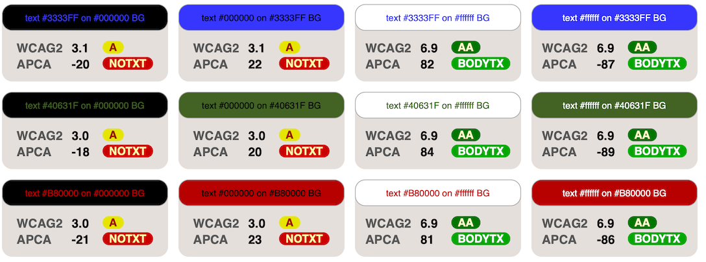
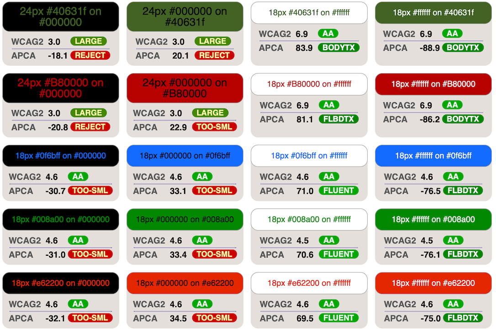
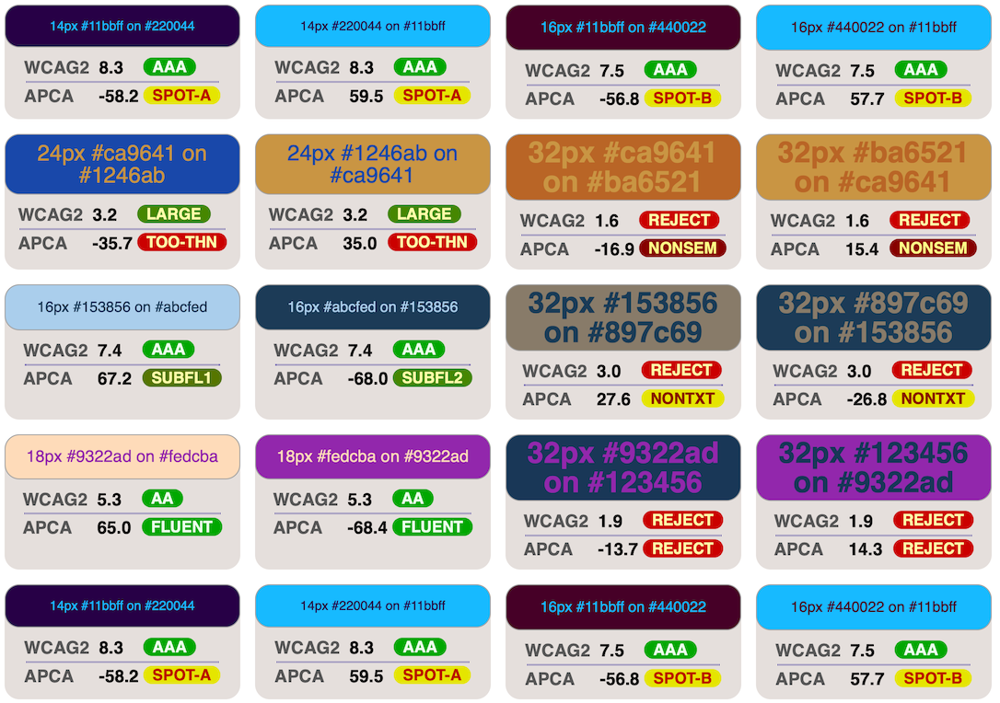

# The missing introduction to APCA

## *What is APCA in three sentences:*
It is a supra threshold visual contrast prediction model that is specifically tuned to readability on self-illuminated displays. It follows human perception, including critical aspects such as spatial frequency, meaning font weight and size. The APCA guidelines also inform various use cases, such as body text, fluent text, spot reading text, and non-text items.

### *WCAG 2 compatibility?*
APCA is enough of a paradigm shift that it is not backwards compatible with the old WCAG&nbsp;2 contrast, and WCAG&nbsp;3 is some time away from being the recommendation.

So in the meantime, there is the Bridge-PCA, which is backward compatible to WCAG&nbsp;2, but using APCA technology. One of the urgent reasons Bridge-PCA is needed is the rise in popularity of *"Dark Mode."*

### *Bridge PCA for Dark Mode*
As shown above, WCAG&nbsp;2 contrast fails most with dark colors, and the results are relatively meaningless for colors for Dark Mode. APCA and Bridge&nbsp;PCA do very well with contrast prediction and guidance for dark mode.

**Here's a [short linktree](https://linktr.ee/Myndex) of related links.**      
**And a [more in depth](https://git.myndex.com) link catalog.**


The [Accessible Perceptual Contrast Algorithm (APCA)](https://git.apcacontrast.com/)
is a new algorithm to predict the perceived lightness contrast between two adjacent colors. It was developed to address some issues in earlier algorithms, especially for dark colors, or when the text is lighter than the background.

APCA was created by Andrew Somers at Myndex Research, and under the oversight of the Visual Contrast subgroup of Silver, and is the candidate method for contrast for [WCAG&nbsp;3](https://www.w3.org/TR/wcag-3.0/) (W3C Accessibility Guidelines).

The official interactive demo is available at [www.myndex.com/APCA/](https://www.myndex.com/APCA/).

## Algorithm

```js

// Estimated screen Ys from simple RGB int array [255,255,255]
function sRGBtoY(srgb) {
  var r = Math.pow(srgb[0] / 255, 2.4);
  var g = Math.pow(srgb[1] / 255, 2.4);
  var b = Math.pow(srgb[2] / 255, 2.4);
  var ys = 0.2126729 * r + 0.7151522 * g + 0.0721750 * b;

  // Soft black clamp for flare and other purposes.
  if (ys < 0.022) {
    ys += Math.pow(0.022 - ys, 1.414);
  }
  return ys;
}

// Send text and bg color, as simple RGB int arrays [255,255,255]
function contrastAPCA(tx, bg) {
  var ystx = sRGBtoY(tx);
  var ysbg = sRGBtoY(bg);
  var sapc = 1.14;
  var offset = 0.027;

  // Calculate raw SAPC contrast value
  if (ysbg > ystx) {
    sapc *= Math.pow(ysbg, 0.56) - Math.pow(ystx, 0.57);
  } else {
    sapc *= Math.pow(ysbg, 0.65) - Math.pow(ystx, 0.62);
  }

  // Clamp low Lc values to 0, otherwise offset.
  if (Math.abs(sapc) < 0.1) {
    return 0;
  } else if (sapc > 0) {
    sapc -= offset;
  } else {
    sapc += offset;
  }

  // return APCA Lc value as a signed number
  return sapc * 100;
}
```

([Source](https://github.com/Myndex/SAPC-APCA/blob/master/documentation/APCA-W3-LaTeX.md))

## Migrating from WCAG&nbsp;2.x

- WCAG&nbsp;2.x produces a ratio between 1:1 and 21:1. APCA produces a value roughly between -108 to 0 for light text (on a dark background), and 0 to 106 for dark text.
- Unlike WCAG&nbsp;2.x, APCA reports different values when you switch text color and background color.
- The result of APCA is negative for light text on dark background. You will usually work with the absolute value though.
- WCAG 2.x defined three thresholds: 3:1, 4.5:1, and 7:1. These *roughly* correspond to 45, 60, and 75 in APCA.
- Compared to WCAG&nbsp;2.x, APCA reports drastically lower contrast for darker colors. It also reports slightly higher contrast for lighter colors.
- Unlike WCAG&nbsp;2.x, APCA divides needed contrast into use case categories.
    - In some use cases, such as for columns of body text, APCA is stricter
    - APCA is more flexible though, by handling for "derated" use cases. For instance, non-content text like a copyright bug are permitted lower contrast (prevents distraction).

Also see [APCA In A Nutshell](https://git.apcacontrast.com/documentation/APCA_in_a_Nutshell).

## Comparative Examples

[](https://xi.github.io/apca-introduction/examples/)
[](https://xi.github.io/apca-introduction/examples/)
[](https://xi.github.io/apca-introduction/examples/)

### Official Comparison from Myndex Research:
This comparison uses achromatic grays as those define readability.


## Status

WCAG&nbsp;2 is a guideline developed and recommended by the W3.org. While WCAG&nbsp;2 is not legally binding itself, it has become a normative part of some laws or regulations in some specific jurisdictions around the globe. 

Currently both APCA and the future WCAG&nbsp;3.0 are in active development. At the time of this writing, neither is officially recommended by the W3C.

APCA is also being developed independently for other standards and guidelines beyond web content.

## Evaluating APCA

Evaluating a contrast algorithm is fairly straight forward as far as determining perceptual uniformity, or in other words, efficacy in terms of the predicted, relative amount of contrast across the visual range. This is because  all sighted users have similarly *shaped* contrast sensitivity curves when it comes to achromatic luminance (literally, the colorless black to white range of lightness). 

Luminance is the measure of light coming from the display, and perceived lightness is how a human judges the lightness or brightness, in the context of the surrounding environment. Luminance is processed by the human vision system in a manner that makes it critical for readability.

On the other hand, the *thresholds* chosen for guidelines—i.e., how much contrast does a given element need—is more complicated. All sighted users have substantial contrast needs for best readability. Some users have impairments that cause a reduced contrast sensitivity, and those users need higher contrasts in general. But other users may be over-sensitive to high contrasts, and they then need lower contrasts overall. 

## More

For a deeper dive, start with [_"Why APCA"_](https://git.apcacontrast.com/documentation/WhyAPCA) and the documentation [_README_](https://git.apcacontrast.com/documentation/README) and the more in depth [link catalog](https://git.myndex.com) of related resources.


