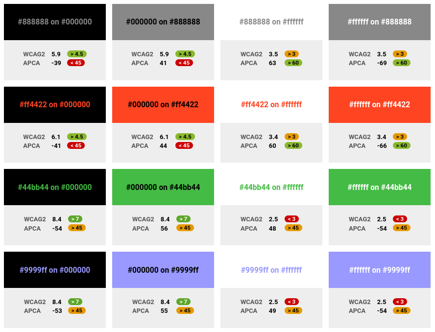
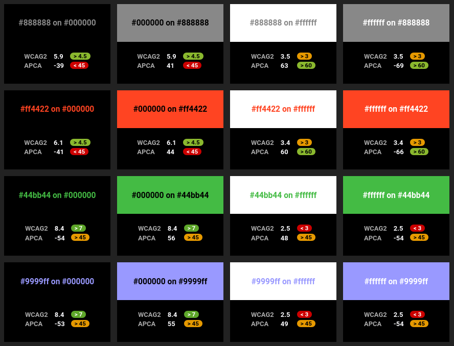

# The missing introduction to APCA

## What is APCA?

The [Accessible Perceptual Contrast Algorithm (APCA)](https://git.apcacontrast.com/)
is a new algorithm to estimate the visual contrast between two colors.
It was developed to address some issues in earlier algorithms, especially for
dark colors.

APCA was created by Andrew Somers (Myndex) and was at some point in the
discussion for the next major version of the [W3C Accessibility Guidelines
(WCAG)](https://www.w3.org/TR/2021/WD-wcag-3.0-20211207/).

An interactive demo is available at <https://xi.github.io/apca-introduction/tool/>.

## Algorithm

```js
function sRGBtoY(srgb) {
  var r = Math.pow(srgb[0] / 255, 2.4);
  var g = Math.pow(srgb[1] / 255, 2.4);
  var b = Math.pow(srgb[2] / 255, 2.4);
  var y = 0.2126729 * r + 0.7151522 * g + 0.0721750 * b;

  if (y < 0.022) {
    y += Math.pow(0.022 - y, 1.414);
  }
  return y;
}

function contrast(fg, bg) {
  var yfg = sRGBtoY(fg);
  var ybg = sRGBtoY(bg);
  var c = 1.14;

  if (ybg > yfg) {
    c *= Math.pow(ybg, 0.56) - Math.pow(yfg, 0.57);
  } else {
    c *= Math.pow(ybg, 0.65) - Math.pow(yfg, 0.62);
  }

  if (Math.abs(c) < 0.1) {
    return 0;
  } else if (c > 0) {
    c -= 0.027;
  } else {
    c += 0.027;
  }

  return c * 100;
}
```

([Source](https://github.com/Myndex/SAPC-APCA/blob/master/documentation/APCA-W3-LaTeX.md))

## Comparison to WCAG 2.x

- WCAG 2.x produces a ratio between 1:1 and 21:1. APCA produces a value between
  -108 and 105.
- Unlike WCAG 2.x, APCA reports different values when you switch foreground and
  background.
- The result of APCA is negative for light text on dark background. You will
  usually work with the absolute value though.
- WCAG 2.x defines three thresholds: 3:1, 4.5:1, and 7:1. In APCA,
  thresholds depend on other factors such as font size and weight.
- Compared to WCAG 2.x, APCA reports drastically lower contrast for darker
  colors. It also reports slightly higher contrast for lighter colors.

Also see my [detailed analysis](analysis.md).

## Examples

[](https://xi.github.io/apca-introduction/examples/)
[](https://xi.github.io/apca-introduction/examples/)

## Status

WCAG is an important standard that is a normative part of many laws all over
the world. If APCA will be part of WCAG 3 it will have a huge impact.
However, currently both WCAG 3 and APCA are still in early development.
Neither is officially recommended by the W3C yet. Also, any mention of APCA has
been [removed](https://github.com/w3c/silver/commit/d5b364de1004d76caa7ddc42c0e48860fef3730d)
from the WCAG 3 draft in 2023.

Evaluating a contrast algorithm is extremly difficult because contrast
perception varies from person to person and also depends on the lighting
conditions. Whether APCA is actually better than WCAG 2.x is therefore hard to
tell. I personally could not say from the examples above which one works better
for me. A rigorous scientific evaluation is not yet available
([issue](https://github.com/w3c/silver/issues/574)).

## Why this document

The original author has published a lot of information on APCA. So why did I
create this introduction?

For one it was born out of my personal frustration with the original
documentation. Some important pieces of information (e.g. the actual algorithm)
get buried under all that text.

It also contains a lot of misleading statements. For example, it claims that
the WCAG 2.x algorithm is not based on human perception (which it is) and that
it produces "invalid results", which the author only substantiates by anecdotal
evidence. So I felt like there was room for a more balanced introduction.

Also, contributing upstream fixes is not an option because the author is
hostile to a cricitcal examination of their work. You can find ample evidence
of their behavior in the issue tracker of this repo.

If you want to dig deeper, I recommend to start with the [original WCAG
issue](https://github.com/w3c/wcag/issues/695) and the [documentation
README](https://git.apcacontrast.com/documentation/README).
