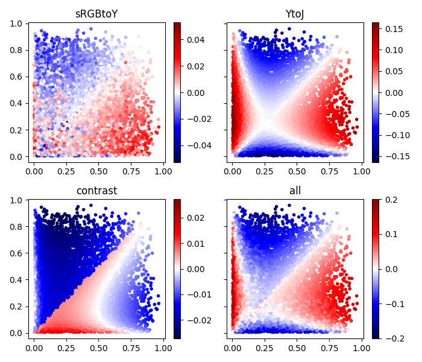

# Detailed analysis of APCA (2022-07-16)

I am a regular web developer with a bachelor's degree in math, but without any
training in the science around visual perception. That's why I cannot evaluate
whether APCA is *better* than WCAG 2.x. Instead this is a systematic
comparison of their mathemetical properties.

## Context: The Web Content Accessibility Guidelines (WCAG)

APCA was developed to address some issues related to contrast in the [Web
Content Accessibility Guidelines] (WCAG). WCAG is an official W3C
recommendation, a normative part of many laws all over the world, and generally
a good read.

WCAG faces a difficult challenge though: There is no one-size-fits-all solution
for accessibility. Different humans have different needs, and different
situations require different kinds of support.

This is also the case in the context of color contrast: vision impairments,
ambient light, and screen settings can all have a pronounced impact on
legibility. None of these are known beforehand by website authors, so the rules
provided by WCAG need to work regardless of these factors.

Faced with the question whether it wanted to give precise instructions (that
might not be ideal in every situation) or give nuanced but ultimately vague
advise, WCAG went with the former. So today WCAG provides a list of detailed
steps for evaluating a website. Many of these checks can be automated. It does
not always result in perfect accessibility, but it gives lawmakers a solid
baseline.

## Components of contrast

When we speak about contrast, we actually mean a few different things:

-   How is the contrast between two colors calculated?
-   Which thresholds are used to decide whether that contrast is sufficient?
-   How do other features like font size and font weight factor into that
    decision?
-   Which parts of the UI need to be checked?

In the following sections I will take a closer look at how WCAG 2.x and APCA
answer each of these questions.

## The contrast formula

> all models are wrong, but some are useful\
> -- George Box

There is no *true* contrast formula. Instead, these formulas are supposed to
predict how most humans perceive a color combination, even if they cannot be
correct 100% of the time.

### A naive approach

```js
function sRGBtoY(srgb) {
  return (srgb[0] + srgb[1] + srgb[2]) / 3;
}

function contrast(fg, bg) {
  var yfg = sRGBtoY(fg);
  var ybg = sRGBtoY(bg);

  return ybg - yfg;
};
```

This naive approach provides a baseline for the other formulas we will look at.
It does not consider anything we know about human vision, but it already
features the basic structure: We first transform each color to a value that
represents lightness. Then we calculate a difference between the two lightness
values.

### WCAG 2.x

```js
function gamma(x) {
  if (x < 0.04045) {
    return x / 12.92;
  } else {
    return Math.pow((x + 0.055) / 1.055, 2.4);
  }
}

function sRGBtoY(srgb) {
  var r = gamma(srgb[0] / 255);
  var g = gamma(srgb[1] / 255);
  var b = gamma(srgb[2] / 255);

  return 0.2126 * r + 0.7152 * g + 0.0722 * b;
}

function contrast(fg, bg) {
  var yfg = sRGBtoY(fg);
  var ybg = sRGBtoY(bg);

  var c = (ybg + 0.05) / (yfg + 0.05);
  return (c < 1) ? 1 / c : c;
};
```

In WCAG 2.x we see the same general structure, but the individual steps are
more complicated:

Colors on the web are defined in the [sRGB color space]. The first part of this
formula is the official formula to convert a sRGB color to luminance. Luminance
is a measure for the amount of light emitted from the screen. Doubling sRGB
values (e.g. from `#444` to `#888`) does not actually double the physical
amount of light, so the first step is a non-linear "gamma decoding". Then the
red, green, and blue channels are weighted to sum to the final luminance. The
weights result from different sensitivities in the human eye: Yellow light has
a much bigger response than the same amount of blue light.

Next the [Weber contrast] of those two luminances is calculated. Weber contrast
has been called the ["gold standard" for text contrast]. It is usually defined
as `(yfg - ybg) / ybg` which is the same as `yfg / ybg - 1`. In this case, 0.05
is added to both values to account for ambient light. The shift by 1 is removed
because it has no impact on the results (as long as the thresholds are adapted
accordingly).

Finally, the polarity is removed so that the formula has the same results when
the two colors are switched.

All in all this is a pretty solid contrast formula (at least from a theoretical
perspective), as it just reuses parts from well established standards.

### APCA

```js
function sRGBtoY(srgb) {
  var r = Math.pow(srgb[0] / 255, 2.4);
  var g = Math.pow(srgb[1] / 255, 2.4);
  var b = Math.pow(srgb[2] / 255, 2.4);
  var y = 0.2126729 * r + 0.7151522 * g + 0.0721750 * b;

  if (y < 0.022) {
    y += Math.pow(0.022 - y, 1.414);
  }
  return y;
}

function contrast(fg, bg) {
  var yfg = sRGBtoY(fg);
  var ybg = sRGBtoY(bg);
  var c = 1.14;

  if (ybg > yfg) {
    c *= Math.pow(ybg, 0.56) - Math.pow(yfg, 0.57);
  } else {
    c *= Math.pow(ybg, 0.65) - Math.pow(yfg, 0.62);
  }

  if (Math.abs(c) < 0.1) {
    return 0;
  } else if (c > 0) {
    c -= 0.027;
  } else {
    c += 0.027;
  }

  return c * 100;
};
```

Again we can see the same structure: We first convert colors to lightness, then
calculate the difference between them. However, in order to be able to compare
APCA to WCAG 2.x, I will make some modifications:

-   The final steps do some scaling and shifting that only serves to get nice
    threshold values. Just like the shift by 1 in the WCAG formula, this can
    simply be ignored.

-   I will also ignore the `< 0.1` condition because it only affects contrasts
    that are too low to be interesting anyway.

-   The contrast is calculated as a difference, not as a ratio as in WCAG. I
    will look at the `exp()` of that difference. Since
    `exp(a - b) == exp(a) / exp(b)`, this allows us to convert the APCA formula
    from a difference to a ratio. Again I user the same trick: Since `exp()` is
    monotonic, it does not change the results other than moving the
    thresholds.

With those changes. All other differences between APCA and WCAG 2.x can be
pushed into `sRGBtoY()`:

```js
function sRGBtoY_modified(srgb, exponent) {
  var r = Math.pow(srgb[0] / 255, 2.4);
  var g = Math.pow(srgb[1] / 255, 2.4);
  var b = Math.pow(srgb[2] / 255, 2.4);
  var y = 0.2126729 * r + 0.7151522 * g + 0.0721750 * b;

  if (y < 0.022) {
    y += Math.pow(0.022 - y, 1.414);
  }
  return Math.exp(Math.pow(y, exponent));
}
```

An interesting feature of APCA is that it uses four different exponents for
light foreground (0.62), dark foreground (0.57), light background (0.56), and
dark background (0.65). `sRGBtoY_modified()` takes that exponent as a second
parameter.

Now that we have aligned the two formulas, what are the actual differences?

This conversion again uses sRGB coefficients. However, the non-linear part is
very different. The author of APCA provides some motivation for these changes
in the article [Regarding APCA Exponents]. The main argument seems to be that
this more closely models real-world computer screens.

To get a better feeling for how these formulas compare, I plotted the results
of `sRGBtoY()`. In order to reduce colors to a single dimension, I used gray
`[x, x, x]`, red `[x, 0, 0]`, green `[0, x, 0]` and blue `[0, 0, x]` values.

I also normalized the values so they are in the same range as WCAG 2.x. I used
factors (because they do not change the contrast ratio) and powers (because
they are monotonic on the contrast ratio).

```js
var average_exponent = 0.6;
var y0 = Math.exp(Math.pow(0.022, 1.414 * average_exponent));
var y1 = Math.exp(1);

function normalize(y) {
  // scale the lower end to 1
  y /= y0;

  // scale the upper end to 21
  // we use a power so the lower end stays at 1
  y = Math.pow(y, Math.log(21) / Math.log(y1 / y0));

  // scale down to the desired range
  return y / 20;
}
```


The four curves for APCA are very similar. Despite the very different formula,
the WCAG 2.x curve also has a similar shape. I added a modified WCAG 2.x curve
with an ambient light value of 0.4 instead of 0.05. This one is very similar
to the APCA curves. The second column shows the differences between the APCA
curves and this modified WCAG 2.x. 0.4 was just a guess, there might be even
better values.

I also wanted to see how the contrast results compare. I took a random sample
of color pairs and computed the normalized APCA contrast, WCAG 2.x contrast
(without removing the polarity) and the modified WCAG contrast with an ambient
light value of 0.4.



In the top row we see two scatter plots that compare APCA to both WCAG
variants. As we can see, they correlate in both cases, but the modified WCAG
2.x contrast is much closer.

In the bottom row we see two more scatter plots. This time the X axis
corresponds to foreground luminance and the Y axis corresponds to background
luminance. The color of the dots indicated the differences between the
respective formulas, calculated as `log(apca / wcag)`. As we can see, the
biggest differences between APCA and WCAG 2.x are in areas where one color is
extremely light or extremely dark. For light colors, APCA predicts an even
higher contrast (difference is in the same direction as contrast polarity). For
dark colors, APCA predicts a lower contrast (difference is inverse to contrast
polarity).

To sum up, the APCA contrast formula is certainly not as obvious a choice as
the one from WCAG 2.x. I was not able to find much information on how it was
derived. A closer analysis reveals that it is actually not that different from
WCAG 2.x, but assumes much more ambient light. More research is needed to
determine if this higher ambient light value is significant or just an
artifact of the conversion I did.

As we have seen, using a polarity-aware difference instead of a ratio is not a
significant change in terms of results. However, in terms of developer
ergonomics, I personally feel like it is easier to work with. So I would be
happy if this idea sticks.

## Spatial frequency

Smaller text is generally harder to read than bigger text. In a more general
sense, we can speak about the spatial frequency of features. This is usually
measured in cycles per degree (cpd), since the visual field is measured as an
angle.

If content is easy to read because of its spacial frequency, I do not need as
much color contrast. On the other hand, if the spatial frequency is bad, more
color contrast is needed. So we can define a minimum required color contrast
based on spatial frequency.

Interestingly, a lower spatial frequency is not always easier to read though.
[Studies have shown] that the optimal spatial frequency is at about 5-7 cycles
per degree. Below that, features get slightly harder to detect. (Perhaps that
is the reasons for the "you don't see the forest among the trees" phenomenon.)

There is one caveat though: The spatial frequency only defines the contrast
threshold under which a pattern is not perceivable at all. Above that it has
barely any effect. In the context of accessibility we should usually stay well
above that threshold. So it is not clear whether spatial frequency is a useful
concept in this context.

On top of that, it is not obvious how to define spatial frequency for the web.
For text, font size and weight certainly play a role. But different fonts have
wildly different interpretations of these values. Since fonts depend on user
preference, we cannot know beforehand which fonts will be used. We also don't
know the size of device pixels or how far the user is from the screen.

So how do WCAG 2.x and APCA tackle this topic?

### WCAG 2.x

WCAG 2.x makes the distinction between regular and [large text]. Large text is
defined as anything above 18 point or 14 point bold. The definition comes with
a lot of notes that explain the limits of that approach though, e.g. that some
fonts are extremely thin.

WCAG 2.x also comes with some rules that allow users to adapt spatial frequency
to their needs: [1.4.4] requires that users can resize the text, [1.4.10]
requires that they can zoom the whole page, and [1.4.12] requires that they can
adjust text spacing.

So WCAG 2.x doesn't really attempt to model spatial frequency for web content.
It elegantly works around the issue by handing control over to the users who
have all the facts.

### APCA

Conversely, APCA [does attempt to model spatial frequency]:

1.  If the font has an x-height ratio of less than 0.52, increase the size by a
    factor of `0.52 / xHeightRatio`.
2.  Experimentally find a weight offset so the font has a similar weight to
    Arial or Helvetica.
3.  Consider additional font features and adapt the values accordingly.
4.  Use the lookup table provided at the link above to find a minimum contrast
    for the given combination of size and weight.

WCAG 3 is still an early draft and does not yet contain many guidelines. I
assume that guidelines similar to 1.4.4, 1.4.10, and 1.4.12 will again be
included. So the strategy of giving users control over spatial frequency will
still work.

With the more sophisticated link between spatial frequency and color contrast,
user intervention might be less relevant though. However, the model described
above is complicated and leaves a lot of wiggle room, especially in steps 2 and
3.

## Non-text contrast

So far we have mainly looked at text. But other parts of a website also need to
be distinguishable. The concept of spatial frequency was explicitly picked
because it can cover those cases. What do WCAG 2.x and APCA have to say about
this?

### WCAG 2.x

[1.4.11] is specifically about this issue. It basically says that all non-text
content that is not inactive, decorative, or controlled by the browser must
meet contrast requirements. Spatial frequency is not considered in this case.
It is also not always clear which parts of the UI are decorative and which are
actually relevant.

### APCA

As of today, APCA focusses mostly on text. Its sophisticated approach to
spatial frequency has a lot of potential for non-text content. I could not yet
find any discussion of that though.

## Thresholds

### WCAG 2.x

WCAG 2.x defines 3 thresholds: 3, 4.5, and 7.

-   non-text content must have a contrast of at least 3
-   large text must have a contrast of at least 3 (AA) or 4.5 (AAA)
-   other text must have a contrast of at least 4.5 (AA) or 7 (AAA)
-   logos and inactive or decorative elements are exempted

How these values were derived is not completely clear:

> There was some user testing associated with the validation of the 2.0
> formula. I could not quickly find a cite for that. My recollection is that
> the hard data pointed to a ratio of 4.65:1 as a defensible break point. The
> working group was close to rounding that up to 5:1, just to have round
> numbers. I successfully lobbied for 4.5:1 mostly because (1) the empirical
> data was not overwhelmingly compelling, and (2) 4.5:1 allowed the option for
> white and black (simultaneously) on a middle gray.\
> -- <https://github.com/w3c/wcag/issues/695#issuecomment-484187617>

### APCA

APCA defines 6 thresholds: 15, 30, 45, 60, 75, 90.

The required threshold depends on the spatial frequency (see above). 45, 60,
and 75 loosely correspond to 3, 4.5, and 7 in WCAG 2.x.

Again I generated random color pairs and used them to compare APCA to WCAG 2.x:

|        |    < 15 |   15-30 |  30-45 |  45-60 |  60-75 |  75-90 |   > 90 |   total |
| ------:| -------:| -------:| ------:| ------:| ------:| ------:| ------:| -------:|
|    < 3 |  35.3\* |  25.0\* | 11.3\* |    1.7 |    0.0 |    0.0 |    0.0 |    73.3 |
|  3-4.5 |     0.0 |     0.8 |    6.2 |  6.5\* |    0.8 |    0.0 |    0.0 |    14.3 |
|  4.5-7 |     0.0 |     0.0 |    0.8 |    3.8 |  3.7\* |    0.2 |    0.0 |     8.6 |
|    > 7 |     0.0 |     0.0 |    0.0 |    0.2 |    1.8 |  1.6\* |  0.1\* |     3.8 |
|  total |    35.3 |    25.8 |   18.3 |   12.3 |    6.4 |    1.8 |    0.1 |  83.5\* |

The columns correspond to APCA thresholds, the rows correspond to WCAG 2.x
thresholds. For example, 6.2 % of the generated color pairs pass WCAG 2.x with
a contrast above 3, but fail APCA with a contrast below 45 (assuming a
conventional spatial frequency).

The \* indicate cases where both a algorithms agree on a threshold level. The
cell in the bottom right is the total number of cases where both algorithms
agree, so it can be seen as an indicator of how similar the algorithms are.

|           |    < 15 |   15-30 |   30-45 |   45-60 |   60-75 |   75-90 |    > 90 |   total |
| ---------:| -------:| -------:| -------:| -------:| -------:| -------:| -------:| -------:|
|     < 1.6 |  33.7\* |     0.7 |     0.0 |     0.0 |     0.0 |     0.0 |     0.0 |    34.5 |
|   1.6-2.5 |     1.5 |  23.5\* |     0.8 |     0.0 |     0.0 |     0.0 |     0.0 |    25.9 |
|   2.5-3.8 |     0.0 |     1.5 |  15.8\* |     0.2 |     0.0 |     0.0 |     0.0 |    17.5 |
|   3.8-5.7 |     0.0 |     0.0 |     1.7 |  10.4\* |     0.0 |     0.0 |     0.0 |    12.2 |
|   5.7-8.7 |     0.0 |     0.0 |     0.0 |     1.7 |   5.7\* |     0.0 |     0.0 |     7.4 |
|  8.7-13.2 |     0.0 |     0.0 |     0.0 |     0.0 |     0.6 |   1.8\* |     0.0 |     2.4 |
|    > 13.2 |     0.0 |     0.0 |     0.0 |     0.0 |     0.0 |     0.0 |   0.1\* |     0.2 |
|     total |    35.3 |    25.8 |    18.3 |    12.3 |     6.4 |     1.8 |     0.1 |  91.0\* |

The second table compares APCA to the modified WCAG 2.x contrast. The
thresholds were derived by applying the normalization steps described above to
the APCA thresholds. As expected, most color pairs fall into the same category
with both formulas. For example, only 1.7 % pass the modified WCAG 2.x with a
contrast above 3.8, but fail APCA with a contrast below 45.

|         |    < 15 |   15-30 |   30-45 |   45-60 |   60-75 |   75-90 |    > 90 |   total |
| -------:| -------:| -------:| -------:| -------:| -------:| -------:| -------:| -------:|
|    < 15 |  33.6\* |     1.3 |     0.0 |     0.0 |     0.0 |     0.0 |     0.0 |    34.9 |
|   15-30 |     1.3 |  23.1\* |     1.3 |     0.0 |     0.0 |     0.0 |     0.0 |    25.7 |
|   30-45 |     0.0 |     1.4 |  16.5\* |     1.1 |     0.0 |     0.0 |     0.0 |    18.9 |
|   45-60 |     0.0 |     0.0 |     1.2 |  10.4\* |     0.7 |     0.0 |     0.0 |    12.3 |
|   60-75 |     0.0 |     0.0 |     0.0 |     0.8 |   5.2\* |     0.3 |     0.0 |     6.2 |
|   75-90 |     0.0 |     0.0 |     0.0 |     0.0 |     0.3 |   1.5\* |     0.0 |     1.8 |
|    > 90 |     0.0 |     0.0 |     0.0 |     0.0 |     0.0 |     0.0 |   0.1\* |     0.1 |
|   total |    34.9 |    25.8 |    18.9 |    12.3 |     6.2 |     1.8 |     0.1 |  90.4\* |

The third table compares APCA to itself, but with foreground and background
switched. WCAG 2.x does not make a difference between foreground and
background, so this comparison would be pointless there. APCA on the other hand
uses different exponents for foreground and background. This table shows that
this does have a small but still significant impact on the results.

## Conclusion

In this analysis I took a deeper look at the Accessible Perceptual Contrast
Algorithm (APCA), a new algorithm to predict visual contrast. I compared it to
an existing algorithm that has been part of WCAG 2.x, the current standard for
accessibility testing for the web.

Though still in early development, APCA is very different from the older
algorithm in many key aspects:

-   It uses a different luminance calculation that deviates from the standards
    but is supposed to be closer to real world usage.
-   It uses a different way of calculating a contrast from luminances.
-   It uses different scaling. Crucially, this scaling is based on a difference
    rather than a ratio.
-   It uses a more sophisticated link between spatial frequency and minimum
    color contrast that might allow for more nuanced thresholds.

The new contrast formula agrees with WCAG 2.x for 83.5% of color pairs. That
number rises to 91% for a modified WCAG 2.x formula with an ambient light value
of 0.4. This could indicate that APCA assumes more ambient light. It would also
explain why APCA reports lower contrast for darker colors.

I like many of the ideas. However, I am concerned by the lack of publicly
available evidence. It is hard to evaluate APCA from a purely theoretical
standpoint. Thorough empirical validation is required. This has not yet started
and will be a considerable effort. See
<https://github.com/w3c/silver/issues/574>.

[Web Content Accessibility Guidelines]: https://www.w3.org/TR/WCAG21/
[sRGB color space]: https://en.wikipedia.org/wiki/SRGB
[Weber contrast]: https://en.wikipedia.org/wiki/Weber_contrast
["gold standard" for text contrast]: https://github.com/w3c/wcag/issues/695#issuecomment-483805436
[Regarding APCA Exponents]: https://git.apcacontrast.com/documentation/regardingexponents
[Studies have shown]: https://en.wikipedia.org/wiki/Contrast_(vision)#Contrast_sensitivity_and_visual_acuity
[large text]: https://www.w3.org/TR/WCAG21/#dfn-large-scale
[1.4.4]: https://www.w3.org/TR/WCAG21/#resize-text
[1.4.10]: https://www.w3.org/TR/WCAG21/#reflow
[1.4.12]: https://www.w3.org/TR/WCAG21/#text-spacing
[does attempt to model spatial frequency]: https://git.apcacontrast.com/WEBTOOLS/APCA/
[1.4.11]: https://www.w3.org/TR/WCAG21/#non-text-contrast
