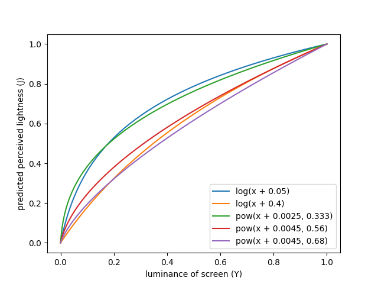

# Detailed analysis of APCA (2022-08-05)

I am a regular web developer with a bachelor's degree in math, but without any
training in the science around visual perception. That's why I cannot evaluate
whether APCA is *better* than WCAG 2.x. Instead this is a systematic
comparison of their mathematical properties.

## Context: The Web Content Accessibility Guidelines (WCAG)

APCA was developed to address some issues related to contrast in the [Web
Content Accessibility Guidelines] (WCAG). WCAG is an official W3C
recommendation, a normative part of many laws all over the world, and generally
a good read.

WCAG faces a difficult challenge though: There is no one-size-fits-all solution
for accessibility. Different humans have different needs, and different
situations require different kinds of support.

This is also the case in the context of color contrast: vision impairments,
ambient light, and screen settings can all have a pronounced impact on
legibility. None of these are known beforehand by website authors, so the rules
provided by WCAG need to work regardless of these factors.

Faced with the question whether it wanted to give precise instructions (that
might not be ideal in every situation) or give nuanced but ultimately vague
advise, WCAG went with the former. So today WCAG provides a list of detailed
steps for evaluating a website. Many of these checks can be automated. It does
not always result in perfect accessibility, but it gives lawmakers a solid
baseline.

## Components of contrast

When we speak about contrast, we actually mean a few different things:

-   How is the contrast between two colors calculated?
-   Which thresholds are used to decide whether that contrast is sufficient?
-   How do other features like font size and font weight factor into that
    decision?
-   Which parts of the UI need to be checked?

In the following sections I will take a closer look at how WCAG 2.x and APCA
answer each of these questions.

## The contrast formula

> all models are wrong, but some are useful\
> -- George Box

There is no *true* contrast formula. Instead, these formulas are supposed to
predict how most humans perceive a color combination, even if they cannot be
correct 100% of the time.

### A naive approach

```js
function sRGBtoL(srgb) {
  return (srgb[0] + srgb[1] + srgb[2]) / 3;
}

function contrast(fg, bg) {
  var lfg = sRGBtoL(fg);
  var lbg = sRGBtoL(bg);

  return lbg - lfg;
};
```

This naive approach provides a baseline for the other formulas we will look at.
It does not consider anything we know about human vision, but it already
features the basic structure: We first transform each color to a value that
represents lightness. Then we calculate a difference between the two lightness
values.

### Historical context

Lightness (L) is a measure for the perceived amount of light. Luminance (Y) is
a measure for the physical amount of light. In order to understand perceived
contrast, we first have to understand the relationship between luminance and
lightness.

In the nineteenth century, E. H. Weber found that human perception works in
relative terms, i.e. the difference between 100 g and 110 g is perceived the
same as the difference between 1000 g and 1100 g. Applied to vision this means
that a contrast between two color pairs is perceived the same if `(Y1 - Y2) /
Y2` has the same value. This is known as Weber contrast and has been called the
["gold standard" for text contrast].

Fechner concluded that the relation between a physical measure `Y` and a
perceived measure `L` can be expressed as `L = a * log(Y) + b`. This is called
the Weber-Fechner law.

In 1961 Stevens published a different model that was found to more accurately
predict human vision. It has the form `L = a * pow(Y, alpha) + b`. The exponent
`alpha` has a value of approximately 1/3.[^1]

### WCAG 2.x

```js
function gamma(x) {
  if (x < 0.04045) {
    return x / 12.92;
  } else {
    return Math.pow((x + 0.055) / 1.055, 2.4);
  }
}

function sRGBtoY(srgb) {
  var r = gamma(srgb[0] / 255);
  var g = gamma(srgb[1] / 255);
  var b = gamma(srgb[2] / 255);

  return 0.2126 * r + 0.7152 * g + 0.0722 * b;
}

function contrast(fg, bg) {
  var yfg = sRGBtoY(fg);
  var ybg = sRGBtoY(bg);

  var c = (ybg + 0.05) / (yfg + 0.05);
  return (c < 1) ? 1 / c : c;
};
```

In WCAG 2.x we see the same general structure as in the naive approach, but the
individual steps are more complicated:

Colors on the web are defined in the [sRGB color space]. The first part of this
formula is the official formula to convert a sRGB color to luminance. Doubling
sRGB values (e.g. from `#444` to `#888`) does not actually double the physical
amount of light, so the first step is a non-linear "gamma decoding". Then the
red, green, and blue channels are weighted to sum to the final luminance. The
weights result from different sensitivities in the human eye: Yellow light has
a much bigger response than the same amount of blue light.

Next, 0.05 is added to both values to account for ambient light that is
reflected on the screen (flare). Since we are in the domain of physical light,
we can just add these values. 0.05 mean that we assume that the flare amounts
to 5% of the white of the screen.[^2]

Then the Weber contrast is calculated. Note that `(Y1 - Y2) / Y2` is the same
as `Y1 / Y2 - 1`. The shift by 1 is removed because it has no impact on the
results (as long as the thresholds are adapted accordingly).

Finally, the polarity is removed so that the formula has the same results when
the two colors are switched.

All in all this is a pretty solid contrast formula (at least from a theoretical
perspective), as it just reuses parts from well established standards.

### APCA

```js
function sRGBtoY(srgb) {
  var r = Math.pow(srgb[0] / 255, 2.4);
  var g = Math.pow(srgb[1] / 255, 2.4);
  var b = Math.pow(srgb[2] / 255, 2.4);
  var y = 0.2126729 * r + 0.7151522 * g + 0.0721750 * b;

  if (y < 0.022) {
    y += Math.pow(0.022 - y, 1.414);
  }
  return y;
}

function contrast(fg, bg) {
  var yfg = sRGBtoY(fg);
  var ybg = sRGBtoY(bg);
  var c = 1.14;

  if (ybg > yfg) {
    c *= Math.pow(ybg, 0.56) - Math.pow(yfg, 0.57);
  } else {
    c *= Math.pow(ybg, 0.65) - Math.pow(yfg, 0.62);
  }

  if (Math.abs(c) < 0.1) {
    return 0;
  } else if (c > 0) {
    c -= 0.027;
  } else {
    c += 0.027;
  }

  return c * 100;
};
```

The conversion from sRGB to luminance uses similar coefficients, but the
non-linear part is very different. The author of APCA provides some motivation
for these changes in the article [Regarding APCA Exponents]. The main argument
seems to be that this is supposed to more closely model real-world computer
screens. This document also explains that this step incorporates flare.

Next, the contrast is calculated based on the Stevens model. Interestingly,
APCA uses four different exponents for light foreground (0.62), dark foreground
(0.57), light background (0.56), and dark background (0.65).

The final steps do some scaling and shifting that only serves to get nice
threshold values. Just like the shift by 1 in the WCAG formula, this does not
effect results as long as the thresholds are adapted accordingly. Note that the
`< 0.1` condition only affects contrasts that are below the lowest threshold
anyway.

This formula is based on the more modern Stevens model, but also has some
unusual parts. The non-standard `sRGBtoY` is hard to evaluate without further
information on how it was derived. All of the exponents are significantly
higher than the common 1/3. Analysis is also complicated by the fact that the
three levels of exponents (gamma, alpha, different exponents for light/dark
foreground/background) are not clearly separated.

### Normalization

To make it easier to compare the two formulas, I will normalize them:

-   clearly seperate the individual steps of the calculation
-   calculate a difference of lightnesses
-   preserve polarity
-   scale to a range of -1 to 1

WCAG 2.x therefore becomes:

```js
function gamma(x) {
  if (x < 0.04045) {
    return x / 12.92;
  } else {
    return Math.pow((x + 0.055) / 1.055, 2.4);
  }
}

function sRGBtoY(srgb) {
  var r = gamma(srgb[0] / 255);
  var g = gamma(srgb[1] / 255);
  var b = gamma(srgb[2] / 255);

  return 0.2126 * r + 0.7152 * g + 0.0722 * b;
}

function YtoL(y) {
  return (Math.log(y + 0.05) - Math.log(0.05)) / Math.log(21);
}

function contrast(fg, bg) {
  var yfg = sRGBtoY(fg);
  var ybg = sRGBtoY(bg);

  var lfg = YtoL(yfg);
  var lbg = YtoL(ybg);

  return lbg - lfg;
};

function normalize(c) {
    return Math.log(c) / Math.log(21);
}
```

APCA becomes:

```js
function sRGBtoY(srgb) {
  var r = Math.pow(srgb[0] / 255, 2.4);
  var g = Math.pow(srgb[1] / 255, 2.4);
  var b = Math.pow(srgb[2] / 255, 2.4);
  var y = 0.2126729 * r + 0.7151522 * g + 0.0721750 * b;

  if (y < 0.022) {
    y += Math.pow(0.022 - y, 1.414);
  }
  return y;
}

function YtoL(y) {
    return Math.pow(y, 0.6);
}

function contrast(fg, bg) {
  var yfg = sRGBtoY(fg);
  var ybg = sRGBtoY(bg);

  var lfg = YtoL(yfg);
  var lbg = YtoL(ybg);

  if (ybg > yfg) {
    return Math.pow(lbg, 0.56 / 0.6) - Math.pow(lfg, 0.57 / 0.6);
  } else {
    return Math.pow(ybg, 0.65 / 0.6) - Math.pow(lfg, 0.62 / 0.6);
  }
};

function normalize(c) {
    return (c / 100 + 0.027) / 1.14;
}
```

### Comparison

Now that we have aligned the two formulas, what are the actual differences?


These are scatter plots based on a random sample of color pairs. The x-axis
corresponds to background luminance, the y-axis corresponds to foreground
luminance (both using the APCA formula). The color of the dots indicated the
differences between the respective formulas.

The plot on the bottom right compares APCA to WCAG 2.x. As we can see, the
biggest differences are in areas where one color is extremely light or
extremely dark. For light colors, APCA predicts an even higher contrast
(difference is in the same direction as contrast polarity). For dark colors,
APCA predicts a lower contrast (difference is inverse to contrast polarity).
The difference goes up to 20%.

The other three plots compare APCA to a modified version of APCA where one of
the steps has been replaced by the corresponding step from WCAG 2.x. This way
we can see that `sRGBtoY` contributes 4% to the difference, `YtoL` contributes
15%, and `contrast` contributes 3%.

Since the conversion from luminance to lightness causes the biggest difference,
I took a closer look at it.



I plotted curves for both the Weber-Fechner model (log) and the Stevens model
(pow) with different parameters.

-   The log curve with a flare of 0.05 (WCAG 2) is closer to the pow curve with
    an exponent of 1/3
-   The log curve with a flare of 0.4 is closer to the pow curves with
    exponents 0.56 and 0.68 (similar to APCA)
-   The pow curve with an exponent of 1/3 **and** a flare of 0.025 is somewhere
    in the middle.

This shows that a big part of the different results between WCAG 2.x and APCA
are caused by a different choice in parameters. If we were to change the flare
value in WCAG 2.x to 0.4 we would get results much closer to APCA. And if we
were to change the exponents in APCA to 1/3 we would get results much closer to
WCAG 2.x.

## Spatial frequency

Smaller text is generally harder to read than bigger text. In a more general
sense, we can speak about the spatial frequency of features. This is usually
measured in cycles per degree (cpd), since the visual field is measured as an
angle.

If content is easy to read because of its spacial frequency, I do not need as
much color contrast. On the other hand, if the spatial frequency is bad, more
color contrast is needed.

There is one caveat though: The spatial frequency only defines the contrast
threshold under which a pattern is not perceivable at all. Above that it has
barely any effect. So we the best way to use it is to define a minimum required
color contrast based on spatial frequency.[^3]

Interestingly, a lower spatial frequency is not always easier to read though.
[Studies have shown] that the optimal spatial frequency is at about 5-7 cycles
per degree. Below that, features get slightly harder to detect. (Perhaps that
is the reasons for the "you don't see the forest among the trees" phenomenon.)

It is not obvious how to define spatial frequency in the context of the web.
For text, font size and weight certainly play a role. But different fonts have
wildly different interpretations of these values. Since fonts depend on user
preference, we cannot know beforehand which fonts will be used. We also don't
know the size of device pixels or how far the user is from the screen.

So how do WCAG 2.x and APCA tackle this topic?

### WCAG 2.x

WCAG 2.x makes the distinction between regular and [large text]. Large text is
defined as anything above 18 point or 14 point bold. The definition comes with
a lot of notes that explain the limits of that approach though, e.g. that some
fonts are extremely thin.

WCAG 2.x also comes with some rules that allow users to adapt spatial frequency
to their needs: [1.4.4] requires that users can resize the text, [1.4.10]
requires that they can zoom the whole page, and [1.4.12] requires that they can
adjust text spacing.

So WCAG 2.x doesn't really attempt to model spatial frequency for web content.
It elegantly works around the issue by handing control over to the users who
have all the facts.

### APCA

Conversely, APCA [does attempt to model spatial frequency]:

1.  If the font has an x-height ratio of less than 0.52, increase the size by a
    factor of `0.52 / xHeightRatio`.
2.  Experimentally find a weight offset so the font has a similar weight to
    Arial or Helvetica.
3.  Consider additional font features and adapt the values accordingly.
4.  Use the lookup table provided at the link above to find a minimum contrast
    for the given combination of size and weight.

WCAG 3 is still an early draft and does not yet contain many guidelines. I
assume that guidelines similar to 1.4.4, 1.4.10, and 1.4.12 will again be
included. So the strategy of giving users control over spatial frequency will
still work.

With the more sophisticated link between spatial frequency and color contrast,
user intervention might be less relevant though. However, the model described
above is complicated and leaves a lot of wiggle room, especially in steps 2 and
3.

## Non-text contrast

So far we have mainly looked at text. But other parts of a website also need to
be distinguishable. The concept of spatial frequency was explicitly picked
because it can cover those cases. What do WCAG 2.x and APCA have to say about
this?

### WCAG 2.x

[1.4.11] is specifically about this issue. It basically says that all non-text
content that is not inactive, decorative, or controlled by the browser must
meet contrast requirements. Spatial frequency is not considered in this case.
It is also not always clear which parts of the UI are decorative and which are
actually relevant.

### APCA

As of today, APCA focusses mostly on text. Its sophisticated approach to
spatial frequency has a lot of potential for non-text content. I could not yet
find any discussion of that though.

## Thresholds

### WCAG 2.x

WCAG 2.x defines 3 thresholds: 3, 4.5, and 7.

-   non-text content must have a contrast of at least 3
-   large text must have a contrast of at least 3 (AA) or 4.5 (AAA)
-   other text must have a contrast of at least 4.5 (AA) or 7 (AAA)
-   logos and inactive or decorative elements are exempted

How these values were derived is not completely clear:

> There was some user testing associated with the validation of the 2.0
> formula. I could not quickly find a cite for that. My recollection is that
> the hard data pointed to a ratio of 4.65:1 as a defensible break point. The
> working group was close to rounding that up to 5:1, just to have round
> numbers. I successfully lobbied for 4.5:1 mostly because (1) the empirical
> data was not overwhelmingly compelling, and (2) 4.5:1 allowed the option for
> white and black (simultaneously) on a middle gray.\
> -- <https://github.com/w3c/wcag/issues/695#issuecomment-484187617>

### APCA

APCA defines 6 thresholds: 15, 30, 45, 60, 75, 90.

The required threshold depends on the spatial frequency (see above). 45, 60,
and 75 loosely correspond to 3, 4.5, and 7 in WCAG 2.x.

### Comparison

Again I generated random color pairs and used them to compare APCA to WCAG 2.x:

|         |    < 15 |   15-30 |   30-45 |   45-60 |   60-75 |   75-90 |    > 90 |   total |
| -------:| -------:| -------:| -------:| -------:| -------:| -------:| -------:| -------:|
|     < 3 |  34.8\* |  25.1\* |  11.7\* |     1.5 |     0.0 |     0.0 |     0.0 |    73.0 |
|   3-4.5 |     0.0 |     0.7 |     6.3 |   6.7\* |     0.9 |     0.0 |     0.0 |    14.5 |
|   4.5-7 |     0.0 |     0.0 |     0.7 |     3.9 |   3.9\* |     0.2 |     0.0 |     8.7 |
|     > 7 |     0.0 |     0.0 |     0.0 |     0.3 |     1.7 |   1.6\* |   0.2\* |     3.8 |
|   total |    34.8 |    25.8 |    18.6 |    12.3 |     6.5 |     1.8 |     0.2 |  83.9\* |

The columns correspond to APCA thresholds, the rows correspond to WCAG 2.x
thresholds. For example, 6.3 % of the generated color pairs pass WCAG 2.x with
a contrast above 3, but fail APCA with a contrast below 45.

The \* indicate cases where both a algorithms agree on a threshold level. The
cell in the bottom right is the total number of cases where both algorithms
agree, so it can be seen as an indicator of how similar the algorithms are.

|         |    < 15 |   15-30 |   30-45 |   45-60 |   60-75 |   75-90 |    > 90 |   total |
| -------:| -------:| -------:| -------:| -------:| -------:| -------:| -------:| -------:|
|   < 3.5 |  34.8\* |  25.7\* |  15.1\* |     4.1 |     0.1 |     0.0 |     0.0 |    79.6 |
| 3.5-3.5 |     0.0 |     0.1 |     3.5 |   6.5\* |     2.4 |     0.0 |     0.0 |    12.6 |
|   5.5-6 |     0.0 |     0.0 |     0.1 |     1.7 |   3.3\* |     0.4 |     0.0 |     5.4 |
|     > 8 |     0.0 |     0.0 |     0.0 |     0.1 |     0.8 |   1.4\* |   0.2\* |     2.4 |
|   total |    34.8 |    25.8 |    18.6 |    12.3 |     6.5 |     1.8 |     0.2 |  86.9\* |

The second table again compares APCA to WCAG 2.x, but this time I tweaked the
thresholds to minimize the difference. This shows that some of the difference
is caused by the choice of thresholds, not the formula itself.

|         |    < 15 |   15-30 |   30-45 |   45-60 |   60-75 |   75-90 |    > 90 |   total |
| -------:| -------:| -------:| -------:| -------:| -------:| -------:| -------:| -------:|
|   < 1.6 |  33.3\* |     0.7 |     0.0 |     0.0 |     0.0 |     0.0 |     0.0 |    34.0 |
| 1.6-2.5 |     1.4 |  23.5\* |     0.7 |     0.0 |     0.0 |     0.0 |     0.0 |    25.6 |
| 2.5-3.9 |     0.0 |     1.6 |  16.8\* |     0.5 |     0.0 |     0.0 |     0.0 |    18.9 |
|   3.9-6 |     0.0 |     0.0 |     1.1 |  11.2\* |     0.3 |     0.0 |     0.0 |    12.6 |
|     6-9 |     0.0 |     0.0 |     0.0 |     0.6 |   5.9\* |     0.1 |     0.0 |     6.6 |
|    9-13 |     0.0 |     0.0 |     0.0 |     0.0 |     0.3 |   1.7\* |     0.0 |     2.0 |
|    > 13 |     0.0 |     0.0 |     0.0 |     0.0 |     0.0 |     0.1 |   0.2\* |     0.2 |
|   total |    34.8 |    25.8 |    18.6 |    12.3 |     6.5 |     1.8 |     0.2 |  92.5\* |

The third table compares APCA to a modified WCAG 2.x contrast with a flare
value of 0.4. As expected, the difference is reduced significantly, though
there is still a considerable difference left.

|         |    < 15 |   15-30 |   30-45 |   45-60 |   60-75 |   75-90 |    > 90 |   total |
| -------:| -------:| -------:| -------:| -------:| -------:| -------:| -------:| -------:|
|    < 15 |  33.6\* |     1.3 |     0.0 |     0.0 |     0.0 |     0.0 |     0.0 |    34.9 |
|   15-30 |     1.2 |  23.2\* |     1.2 |     0.0 |     0.0 |     0.0 |     0.0 |    25.5 |
|   30-45 |     0.0 |     1.3 |  16.3\* |     1.1 |     0.0 |     0.0 |     0.0 |    18.8 |
|   45-60 |     0.0 |     0.0 |     1.2 |  10.4\* |     0.9 |     0.0 |     0.0 |    12.5 |
|   60-75 |     0.0 |     0.0 |     0.0 |     0.8 |   5.4\* |     0.2 |     0.0 |     6.4 |
|   75-90 |     0.0 |     0.0 |     0.0 |     0.0 |     0.3 |   1.6\* |     0.1 |     1.9 |
|    > 90 |     0.0 |     0.0 |     0.0 |     0.0 |     0.0 |     0.0 |   0.1\* |     0.1 |
|   total |    34.8 |    25.8 |    18.6 |    12.3 |     6.5 |     1.8 |     0.2 |  90.4\* |

The last table compares APCA to itself, but with foreground and background
switched. WCAG 2.x does not make a difference between foreground and
background, so this comparison would be pointless there. APCA on the other hand
uses different exponents for foreground and background. This table shows that
this does have a small but still significant impact on the results.

## Conclusion

In this analysis I took a deeper look at the Accessible Perceptual Contrast
Algorithm (APCA), a new algorithm to predict visual contrast. I compared it to
an existing algorithm that has been part of WCAG 2.x, the current standard for
accessibility testing for the web.

Though still in early development, APCA is very different from the older
algorithm in many key aspects:

-   It uses a different luminance calculation that deviates from the standards
    but is supposed to be closer to real world usage.
-   It uses a more accurate model and significantly different parameters for
    converting luminance to perceptual lightness.
-   It adds an additional step where different exponents are applied to
    foreground and background.
-   It uses different scaling. Crucially, this scaling is based on a difference
    rather than a ratio.
-   It uses a more sophisticated link between spatial frequency and minimum
    color contrast that might allow for more nuanced thresholds.

The new contrast formula agrees with WCAG 2.x for 83.9% of randomly picked
color pairs. That number rises to 92.5% for a modified WCAG 2.x formula with a
flare value of 0.4. As far as I understand, this is not a realistic value for
flare. So the physical interpretation might be incorrect. This would however
explain why APCA reports lower contrast for darker colors.

So far I like many of the ideas of APCA, but I am concerned by the [lack of
publicly available evidence]. Then again, the new algorithm cannot really be
evaluated without first making some policy decisions, e.g. which viewing
conditions we are aiming for. I hope this analysis can support the community in
figuring out what questions need to be answered.

[Web Content Accessibility Guidelines]: https://www.w3.org/TR/WCAG21/
[sRGB color space]: https://en.wikipedia.org/wiki/SRGB
["gold standard" for text contrast]: https://github.com/w3c/wcag/issues/695#issuecomment-483805436
[Regarding APCA Exponents]: https://git.apcacontrast.com/documentation/regardingexponents
[Studies have shown]: https://en.wikipedia.org/wiki/Contrast_(vision)#Contrast_sensitivity_and_visual_acuity
[large text]: https://www.w3.org/TR/WCAG21/#dfn-large-scale
[1.4.4]: https://www.w3.org/TR/WCAG21/#resize-text
[1.4.10]: https://www.w3.org/TR/WCAG21/#reflow
[1.4.12]: https://www.w3.org/TR/WCAG21/#text-spacing
[does attempt to model spatial frequency]: https://git.apcacontrast.com/WEBTOOLS/APCA/
[1.4.11]: https://www.w3.org/TR/WCAG21/#non-text-contrast
[lack of publicly available evidence]: https://github.com/w3c/silver/issues/574

[^1]: [Monaci, Gianluca & Menegaz, Gloria & Susstrunk, S. & Knoblauch, Kenneth. (2022). Color Contrast Detection in Spatial Chromatic Noise.](https://www.researchgate.net/publication/37435854_Color_Contrast_Detection_in_Spatial_Chromatic_Noise)
[^2]: [Hwang AD, Peli E. (2016). New Contrast Metric for Realistic Display Performance Measure.](https://www.ncbi.nlm.nih.gov/pmc/articles/PMC5489230/)
[^3]: [Georgeson, M. A., & Sullivan, G. D. (1975). Contrast constancy: deblurring in human vision by spatial frequency channels.](https://pubmed.ncbi.nlm.nih.gov/1206570/)
